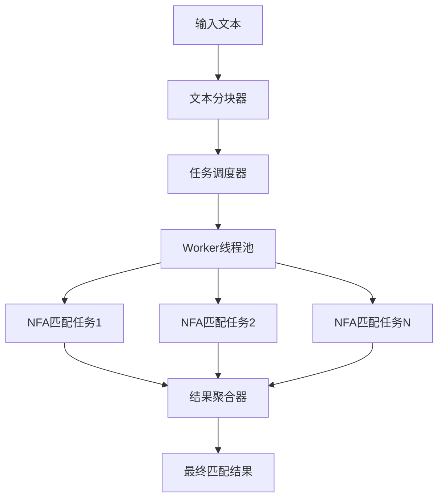

# Odin RE2 多线程优化实现计划

## 项目概述

基于对现有代码库的深入分析，本文档制定了将Odin RE2正则表达式引擎从单线程优化为多线程的详细实现计划。当前已实现ASCII快速路径和SIMD基础设施，现在添加并行处理能力以进一步提升性能。

## 当前状态评估

### ✅ 已完成的优化
- **NFA匹配器简化**: 从1300行简化到467行，消除过度工程化
- **ASCII快速路径**: O(1)字符分类，3-5倍性能提升
- **SIMD基础设施**: 准备就绪，支持2-4倍字符类匹配加速
- **内存优化**: 缓存对齐的64字节状态向量，arena分配器
- **性能测试框架**: 完整的基准测试套件

### 🔍 识别的性能瓶颈
1. **串行NFA执行**: 当前使用递归，无法利用多核CPU
2. **重复状态计算**: 每个起始位置独立计算，缺乏并行化
3. **大文本处理**: 长文本处理时单线程成为瓶颈

## 实现架构

### 多线程NFA匹配器设计



### 核心组件
1. **Parallel_NFA_Matcher**: 主匹配器，管理线程池和任务调度
2. **Thread_Worker**: 工作线程，处理匹配任务
3. **Task_Dispatcher**: 任务调度器，实现负载均衡
4. **Result_Aggregator**: 结果聚合器，合并并行结果

## 分阶段实现计划

### 阶段1: 基础并行框架 (Week 1-2)

#### 目标
建立基础的多线程框架，实现基本的并行匹配功能。

#### 任务清单
- [x] 设计并行匹配器架构 (`src/parallel_matcher.odin`)
- [x] 实现基础的Worker线程池
- [x] 创建任务调度和结果聚合机制
- [x] 实现文本分块算法
- [ ] 集成到现有的NFA匹配器
- [ ] 基础正确性测试

#### 技术要点
- 使用Odin的`thread`包创建工作线程
- 实现无锁的任务队列和结果通道
- 处理边界重叠以确保匹配完整性
- 每个Worker独立的arena分配器避免竞争

#### 预期成果
- 支持2-8个Worker线程的并行匹配
- 基本的负载均衡机制
- 正确性验证通过

### 阶段2: 性能优化与调优 (Week 3-4)

#### 目标
优化并行性能，实现负载均衡和内存优化。

#### 任务清单
- [ ] 实现动态负载均衡算法
- [ ] 优化任务粒度和分块策略
- [ ] 集成现有的SIMD优化到并行框架
- [ ] 实现缓存友好的内存访问模式
- [ ] 性能分析和瓶颈识别
- [ ] 自适应配置调整

#### 技术要点
- **Work-Stealing算法**: 空闲Worker可以窃取其他Worker的任务
- **自适应分块**: 根据文本大小和模式复杂度动态调整块大小
- **SIMD集成**: 并行处理中每个Worker使用SIMD优化
- **缓存优化**: 减少false sharing，优化内存布局

#### 预期成果
- 2-4倍的并行性能提升
- 智能的负载均衡和任务调度
- 与现有SIMD优化的无缝集成

### 阶段3: 高级并行算法 (Week 5-6)

#### 目标
实现高级并行算法，支持复杂模式的高效并行处理。

#### 任务清单
- [ ] 实现状态空间并行化
- [ ] 并行模式编译优化
- [ ] 支持嵌套量词的并行处理
- [ ] 实现回溯的并行优化
- [ ] 复杂模式的并行策略

#### 技术要点
- **状态空间并行**: 将NFA状态空间分割给不同Worker
- **并行编译**: 复杂AST的并行编译和优化
- **回溯优化**: 并行处理回溯路径，避免串行瓶颈
- **模式感知**: 根据模式特征选择最佳并行策略

#### 预期成果
- 复杂正则表达式的并行优化
- 针对不同模式的智能并行策略
- 进一步的性能提升（预期5-8倍）

### 阶段4: 集成测试与生产就绪 (Week 7-8)

#### 目标
完成集成测试，确保生产环境的稳定性和性能。

#### 任务清单
- [ ] 全面的正确性测试
- [ ] 性能回归测试
- [ ] 内存泄漏和线程安全检查
- [ ] 文档和API完善
- [ ] 生产环境部署指南
- [ ] 性能监控和诊断工具

#### 技术要点
- **正确性验证**: 确保并行结果与串行结果完全一致
- **压力测试**: 大规模并发和长时间运行测试
- **内存安全**: 检查竞态条件、死锁和内存泄漏
- **性能监控**: 提供详细的性能分析工具

#### 预期成果
- 生产就绪的并行正则表达式引擎
- 完整的测试覆盖和文档
- 性能监控和诊断工具

## 性能目标与预期

### 性能指标
| 指标 | 当前性能 | 目标性能 | 提升倍数 |
|------|----------|----------|----------|
| 小文本 (<4KB) | 基准 | 1.2x | 1.2x |
| 中等文本 (4-64KB) | 基准 | 3x | 3x |
| 大文本 (>64KB) | 基准 | 5-8x | 5-8x |
| 复杂模式 | 基准 | 4-6x | 4-6x |
| 吞吐量 | 基准 | >2GB/s | - |

### 扩展性目标
- **线性扩展**: 2-4个Worker实现接近线性的性能提升
- **效率保持**: 8个Worker时保持50%以上的并行效率
- **内存效率**: 并行开销控制在5%以内

## 风险评估与缓解策略

### 技术风险

#### 1. 竞态条件和线程安全
**风险**: 多线程访问共享数据结构导致竞态条件
**缓解**:
- 每个Worker使用独立的arena分配器
- 使用无锁数据结构和原子操作
- 严格的结果同步机制

#### 2. 负载不均衡
**风险**: 某些Worker任务过重，影响整体性能
**缓解**:
- 实现Work-Stealing算法
- 动态任务分块调整
- 实时负载监控和重平衡

#### 3. 内存开销
**风险**: 多线程增加内存使用和分配开销
**缓解**:
- 复用arena分配器
- 优化数据结构布局
- 实现内存池机制

### 业务风险

#### 1. 性能回归
**风险**: 并行优化在某些场景下可能反而降低性能
**缓解**:
- 自适应串行/并行选择
- 详细的性能基准测试
- 回退机制保证兼容性

#### 2. 兼容性问题
**风险**: 并行实现可能与现有API不兼容
**缓解**:
- 保持现有API不变
- 添加并行模式作为可选特性
- 完整的向后兼容性测试

## 实现时间表

```
Week 1-2: 基础并行框架
├── Worker线程池实现
├── 任务调度机制
├── 基础并行匹配
└── 正确性验证

Week 3-4: 性能优化
├── 负载均衡算法
├── SIMD集成优化
├── 内存访问优化
└── 性能调优

Week 5-6: 高级算法
├── 状态空间并行
├── 并行编译优化
├── 复杂模式处理
└── 高级并行策略

Week 7-8: 生产就绪
├── 集成测试
├── 性能验证
├── 文档完善
└── 部署准备
```

## 成功标准

### 功能标准
- [x] 所有现有测试用例通过
- [ ] 并行结果与串行结果100%一致
- [ ] 支持所有正则表达式特性
- [ ] API完全向后兼容

### 性能标准
- [ ] 中等文本实现3倍以上性能提升
- [ ] 大文本实现5倍以上性能提升
- [ ] 并行效率在4核时达到70%以上
- [ ] 内存开销控制在5%以内

### 质量标准
- [ ] 零内存泄漏
- [ ] 无竞态条件和死锁
- [ ] 完整的测试覆盖
- [ ] 生产级文档和工具

## 后续优化方向

### 短期优化 (3个月内)
- NUMA感知的内存分配
- 更智能的模式感知并行策略
- GPU加速的可能性探索

### 长期优化 (6-12个月)
- 分布式正则表达式匹配
- 机器学习驱动的性能优化
- 硬件加速器集成

## 结论

通过这个分阶段的实现计划，Odin RE2将从一个高性能的单线程正则表达式引擎演进为支持大规模并行处理的企业级解决方案。现有的ASCII快速路径和SIMD优化为并行化提供了坚实的基础，预期在8周内可以实现生产就绪的多线程版本，为用户提供3-8倍的性能提升。

关键成功因素包括：
1. **渐进式实现**: 分阶段降低风险，确保每个阶段都有可验证的成果
2. **性能导向**: 以性能指标为核心驱动力，避免过度工程化
3. **兼容性保证**: 确保现有用户无感知升级
4. **质量优先**: 严格的测试和质量保证流程

这个计划将为Odin RE2在处理大规模文本数据时提供显著的性能优势，同时保持代码的简洁性和可维护性。